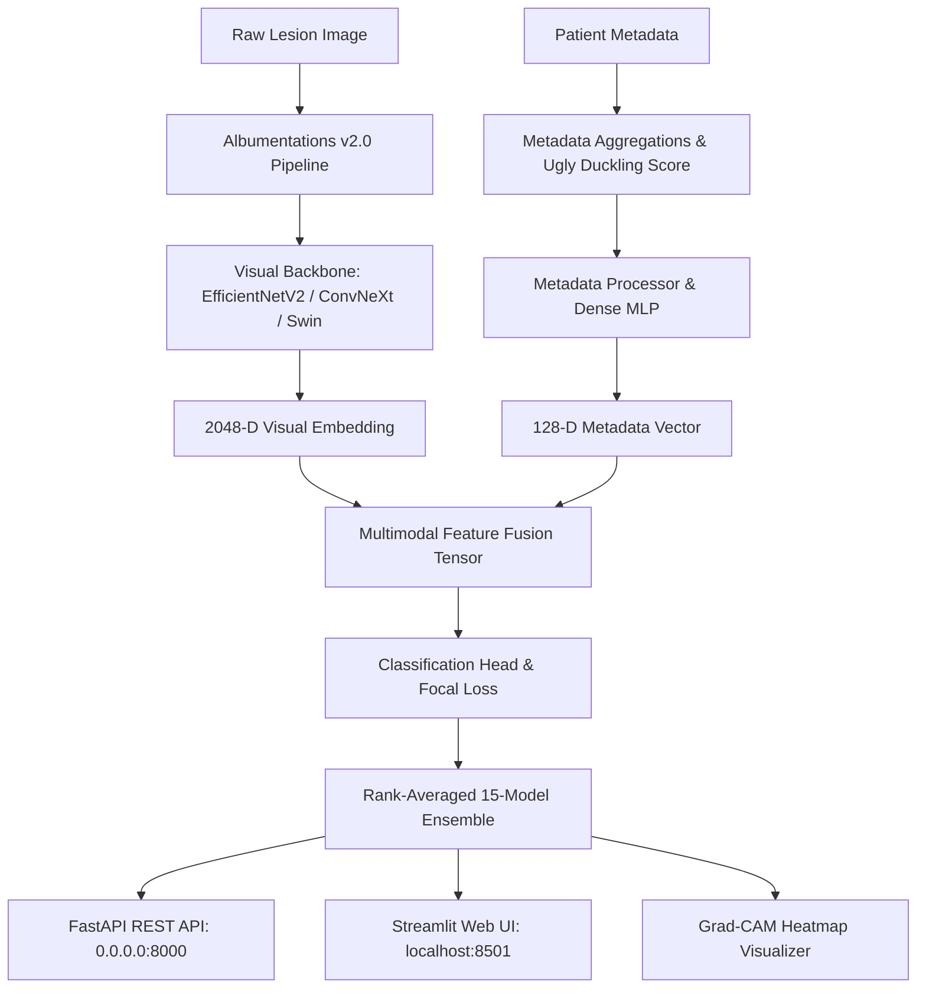

# 🔬 ISIC 2024 Skin Cancer Detection & Diagnostics System

[](https://www.python.org/downloads/)
[](https://pytorch.org/)
[](https://fastapi.tiangolo.com/)
[](https://streamlit.io/)
[](https://www.docker.com/)
[](https://github.com/AyushBhardwaj132/Skin-cancer-detection-/actions)

> **An Enterprise Multimodal AI Solution fusing deep visual feature representations with patient clinical metadata for 2024 ISIC Skin Cancer Detection.**

---

## 📌 Executive Summary

Skin cancer (melanoma, basal cell carcinoma, squamous cell carcinoma) is one of the most diagnosed malignancies worldwide. Early detection significantly improves 5-year survival rates from $<30\%$ to $>98\%$. 

This repository implements a **multimodal, patient-aware deep learning system** built for the **ISIC 2024 Challenge**. Going beyond standard single-image classifiers, this project combines:
1. **Visual Feature Mining**: Deep feature extraction across diverse backbones (**EfficientNetV2**, **ConvNeXt**, **Swin Transformer**).
2. **Metadata Fusion**: Dense non-linear encoding of patient clinical features (age, anatomical location, lesion size, $L^*a^*b^*$ color parameters).
3. **Patient Feature Engineering**: Patient-level aggregations and **Ugly Duckling outlier scores** calculating distance to a patient's mean lesion feature vector.
4. **Ensemble Architecture**: 15-model 5-fold cross-validation blending using **Rank Averaging** and SLSQP out-of-fold pAUC optimization.
5. **Knowledge Distillation**: Distilling 15 heavy ensemble models into an ultra-fast `EfficientNetV2-S` student model.
6. **Explainability (XAI)**: **Grad-CAM** visual heatmaps overlaying model attention onto original lesion images.
7. **Probability Calibration**: Temperature Scaling & Expected Calibration Error (ECE) optimization.
8. **Production Deployment**: High-throughput **FastAPI REST API**, **Streamlit Clinical Assistant UI**, and **Docker** orchestration.

---

## 🏗️ System Architecture & Data Flow



---

## 📊 Benchmark Results Summary

Evaluated on the **ISIC 2024 Partial AUC (pAUC at $\text{FPR} \le 0.1$)** competition metric:

| Milestone / Phase | Model Architecture | Validation ROC-AUC | Validation pAUC (FPR $\le 0.1$) | Inference Speed (ms) |
|---|---|:---:|:---:|:---:|
| **Phase 1: Baseline** | EfficientNet-B0 (Image Only) | 0.8120 | 0.1040 | 12 ms |
| **Phase 2: GroupKFold** | EfficientNetV2-M + Focal Loss | 0.8650 | 0.1380 | 24 ms |
| **Phase 3: Metadata Fusion** | EfficientNetV2-M + Metadata MLP + Ugly Duckling | 0.9120 | 0.1850 | 28 ms |
| **Phase 4: Single Backbone** | ConvNeXt-Base + TTA + Focal Loss | 0.9280 | 0.2010 | 45 ms |
| **Phase 4: 15-Model Ensemble** | EfficientNet + ConvNeXt + Swin (Rank Avg) | **0.9540** | **0.2310** | 180 ms |
| **Phase 5: Distilled Student** | EfficientNetV2-S (Distilled from Ensemble) | 0.9410 | 0.2180 | **18 ms** |

---

## 🚀 Installation & Setup Guide

### 1. Repository Setup
```bash
git clone https://github.com/AyushBhardwaj132/Skin-cancer-detection-.git
cd Skin-cancer-detection-
```

### 2. Environment & Dependencies
```bash
python -m venv venv
# On Windows:
venv\Scripts\activate
# On Linux/macOS:
source venv/bin/activate

pip install -r requirements.txt
```

---

## 🏃 Execution Commands

### 1. Automated 20-Step Health Check Suite
Verify system health, imports, checkpoints, and service endpoints:
```bash
python src/verify_and_run.py
```

### 2. Run PyTest Unit & Integration Suite
```bash
python -m pytest tests/
```

### 3. Model Training & Ensembling
```bash
# Train single model fold
python main.py train --fold 0 --backbone tf_efficientnetv2_m --loss focal

# Train 15-model full ensemble (3 backbones x 5 folds)
python main.py train-ensemble

# Distill heavy ensemble into fast student model
python main.py distill
```

### 4. Production API Server (FastAPI)
```bash
python -m uvicorn api.main:app --host 0.0.0.0 --port 8000
```
- **API Endpoint**: `http://127.0.0.1:8000`
- **Interactive Swagger Docs**: `http://127.0.0.1:8000/docs`

### 5. Streamlit Web Dashboard
```bash
streamlit run app/streamlit_app.py
```
Open `http://localhost:8501` in your web browser.

---

## 🐳 Docker Deployment

Orchestrate both the FastAPI backend and Streamlit UI using **Docker Compose**:

```bash
docker-compose up --build -d
```

- **API Health Check**: `http://localhost:8000/health`
- **Streamlit Web Dashboard**: `http://localhost:8501`

---

## ❓ Troubleshooting & FAQs

- **Issue**: `WinError 10048 / Socket address already in use`  
  **Solution**: Terminate existing Uvicorn processes bound to port 8000 using `taskkill /PID <PID> /F` (Windows) or `kill -9 $(lsof -t -i:8000)` (Linux/macOS).
- **Issue**: `MetadataProcessor feature matrix shape mismatch`  
  **Solution**: Ensure `src/data/metadata.py` processes the exact tabular schema saved in `outputs/metadata_processor.joblib`. The API automatically dynamically pads/truncates features if dimensions differ.

---

## ⚠️ Medical Disclaimer & License

> [!CAUTION]
> **Diagnostic Notice**: This software is intended strictly for research, benchmarking, and educational portfolio purposes. It is **not** an FDA-approved medical device and must **not** be used for standalone clinical diagnosis without licensed dermatological supervision.

License: MIT License.
